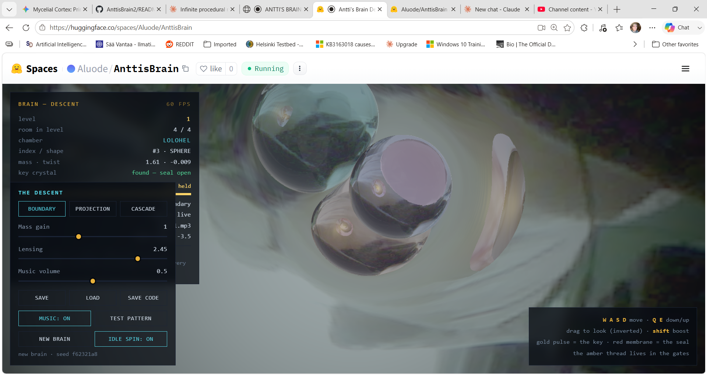

# ANTTI'S BRAIN — DESCENT

EDIT: Fable wrote paper about the maths: resolution_horizon.md

You can play the game with soudntrack at huggingface: 

https://huggingface.co/spaces/Aluode/AnttisBrain

Or here without it: 

https://anttiluode.github.io/AnttisBrain/ 

Or you can download it from huggingface with mp3's: 

git clone https://huggingface.co/spaces/Aluode/AnttisBrain/tree/main

And play it locally. 

An infinite procedural key-hunt built on the Antti's Brain 2 engine (WebGL2 raymarcher, hash-dreamed chambers, refracting crystal moons, webcam boundary). One HTML file, no dependencies, no build step. No enemies, no timers, no hand-made levels — only geometry, depth, and the hash.

Do not hype. Do not lie. Just show.

---

## The math escaped the game

The central rendering trick here — apparently infinite recursive reflections computed with only **four** ray bounces — turned out not to be a graphics hack but a general principle. Each bounce of the mirror operator both dims the image and spatially shrinks it, so the infinite reflection series provably converges, in the only norm a retina can measure, after four applications. Four was the mathematically correct truncation depth all along; it was just chosen by eye first.

Stated once: *when you want unbounded recursive structure, don't simulate the structure — implement one contracting operator and truncate at the observation horizon.*

That principle now has a life of its own as **[Horizon Net](https://github.com/anttiluode/HorizonNet)** — a weight-tied neural network that halts, per input, at the exact iteration where a Banach fixed-point bound proves (or, on unconstrained transformer blocks, measures) that computing deeper can no longer change its answer. Certified anytime inference, born from a hall of mirrors. The repo carries the full honest ledger: what's proven, what's soft, what's still a toy, and what remains to be checked against prior art.

## The Divergence: Trying to Build It "Like Normal"

During development, we took a weird side step trying to make the engine work "like normal." We tried to force variety by writing *more code*. We explicitly coded 12 discrete chamber shapes (cubes, cylinders, stars, gears) using a branched shape function and finite-difference normals. We also abandoned surface optics and forced light rays to march through the volumetric bulk of the glass objects to calculate Snell refraction and Beer-Lambert absorption. 

**The Result:** The GPU rejected it. The branches multiplied by the interior loops created a compile-time bomb that choked the driver for minutes. The heavy bulk transport caused the driver to TDR (Timeout Detection and Recovery) and crash. We had tried to put the complexity into the shader's execution paths, prioritizing physical bulk over constraint-driven beauty.

## The Lesson: Complexity Belongs in Data, Not Code

We learned that to survive the frame budget, we had to return to the logic of the original "Aeon Forge" and the meaning of *Rajapinta* (Boundary). The GPU merely enforced the engine's own metaphysics: information belongs on surfaces, and light travels in a vacuum. 

The fix wasn't to optimize the 12 shapes; it was to delete them. We replaced the shape zoo with **one branchless law**—a single p-norm parametric superellipsoid kernel. Now, a room is no longer a hardcoded shape; it is a point in a continuous shape space defined by a parameter vector (cross-section exponent, profile exponent, squash, angular ripple, torus blend) drawn from the hash. Complexity is encoded entirely into data parameters, not shader branches.

By returning optics to the boundary—reflecting, accumulating, and lensing at the surface without penetrating the bulk—the engine regained its elegance. The shader stays fixed and small, compiling instantly, while generating infinite variety.

---

## The Game

The brain is an endless chain of chambers, a pure function of (SEED, room index).
A level is a run of rooms: level 1 is 4 rooms, level 2 is 5, … capped at 10 per level.

Somewhere in the level, one crystal is the key: it is gold and it pulses. Touch it. The corridor after the level's last room is closed by a red seal — a glowing membrane you cannot pass. Touch the key and the seal dissolves. Walk through: next level.

The resonance meter in the HUD is your only guide: it tells you how many rooms away the key is, and once you're in the right room it runs hot with live distance. Hot / cold, nothing more. There is no way to lose. There is only further down.

## What Deepens with the Level

Everything below is still deterministic — same seed, same descent.

| Property | How it grows |
| :--- | :--- |
| **Level length** | 4 rooms → 10 rooms (cap) |
| **Shape pool** | Rooms morph continuously with depth. Level 1 yields soft orbs; by Level 12 you walk twisted stars; by Level 21 the rooms become rings. The descent widens the parameter distribution. |
| **Twist** | Rooms shear around their vertical axis, stronger with depth. |
| **Ripple** | From level 3, walls start to breathe with a triple-sine displacement. |
| **Mass** | Each room has its own mass factor (shown in HUD); moons grow heavier, lensing pulls harder. |
| **Moons per room** | 3 → 5 |

The moons wear their room's shape, shrunk and rounded into optical glass, meaning new room parameters yield new crystal shapes instantly. Twist and ripple apply on top of any shape vector. 

---

## Controls

*   **W A S D** — move
*   **Q / E** — down / up
*   **Shift** — boost
*   **Drag** — look (horizontal inverted, as tradition demands)

### Modes
*   **Boundary:** The walls are your camera; the moons are curved mirrors that lens and reflect them.
*   **Projection:** The moons carry your face; every wall is a mirror. The image emanates from the bulk (the holographic swap).
*   **Cascade:** Every crystal wears your face and mirrors its neighbors. Holographic accumulation with a capped bounce depth.
*   **Glass:** The honest-physics exhibit. Heavy optics where the ray refracts through the crystal bulk (Snell + Beer-Lambert). Safe to run here because rays terminate at the image wall.

### Toggles
*   **Sliders:** Mass gain, lensing strength, music volume
*   **Music:** on/off — toggles the soundtrack
*   **New brain:** Fresh seed, back to level 1

---

## Save / Load

The entire game state is six numbers: `{version, seed, level, room index, key flag, max level reached}`. Everything else is re-dreamed from the hash on load, including the key's location and the walk direction of the chain (reconstructed by replaying the turn angles — verified bit-exact).

*   **Save:** Writes to localStorage (when the browser allows it) and keeps a code ready.
*   **Save code:** Prints the save as a short base64 string and copies it to the clipboard. This works everywhere, including `file://` pages and sandboxes where localStorage is blocked. Paste it into a text file, an email, a commit message.
*   **Load:** Reads the local save, or accepts a pasted code.

The game autosaves on every level-up and key pickup, and silently resumes on launch if a local save exists. Walking backward is always allowed. Levels you have already beaten stay open (the game remembers your max level, so re-crossing an old seal never re-locks it), but the current level's key must be found each fresh descent into new territory.

---

## Technical Notes

*   **Single Fragment Shader:** One fullscreen triangle, raymarched SDFs.
*   **Unified Parametric SDF:** Rooms and moons share one branchless shape function, driven by a 6-number vector. There are no discrete shape loops to unroll and no finite-difference normal overhead for the analytical bases.
*   **Guaranteed Transitions:** Every SDF has a JavaScript twin used for collision and gate transitions. The deterministic pure function guarantees the room center is deep interior (transition trigger fires at −1.0), so no parametric shape configuration can ever strand you in a wall.
*   **Lipshitz Continuity:** Twist and ripple are applied as domain modifications with a Lipschitz correction factor on the returned distance, so marching stays conservative and never tunnels (guarded against radial singularity blow-ups).
*   **First Paint Compilation:** Shader compilation is deferred until after first paint and uses `KHR_parallel_shader_compile` when available. Loop bounds (march steps, glass-refraction steps, wall-escape steps) are passed as **uniforms**. This forces the D3D/ANGLE compiler to compile the loop body exactly once rather than unrolling a 180-step march, eliminating the compile-time bomb. 
*   **O(1) Hash Generation:** `rng(index, salt)` handles the integer hash. Any room at any depth can be queried in O(1) without generating the rooms before it. Only 3 rooms exist at a time (prev / current / next).

## Running

Open `anttis-brain-descent.html` in any WebGL2 browser. Place `game1.mp3` ... `game10.mp3` in the same directory for endless chained audio. Allow the camera if you want the boundary texture to be you; decline, and the animated test pattern takes over.
